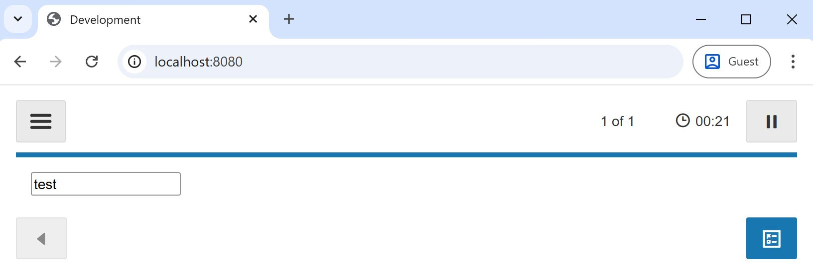
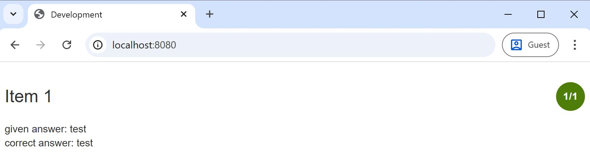
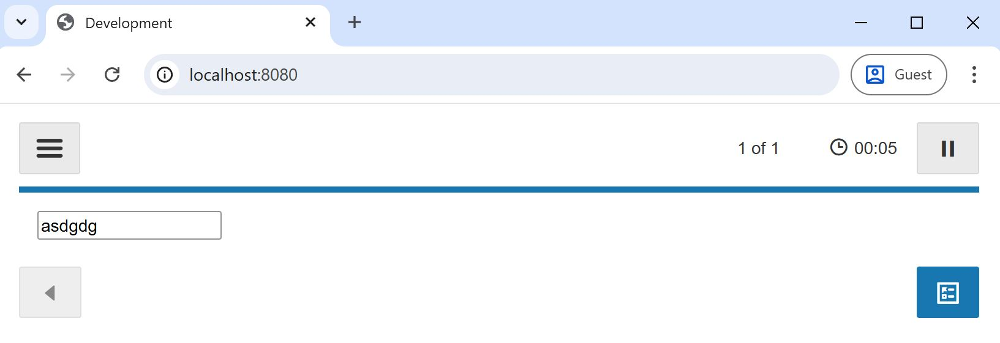
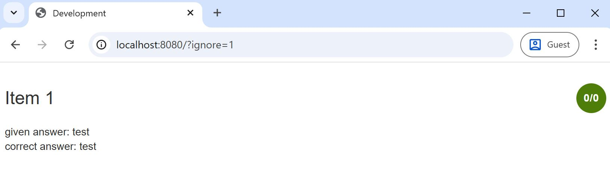
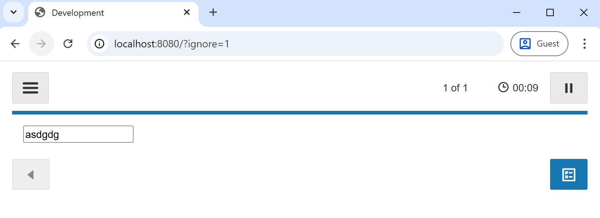
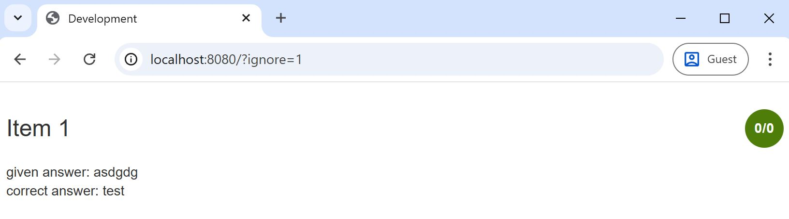

## Overview

This repository contains a simple demo project to help reproduce an issue with `ignore_question_attributes` and custom questions.

It contains a basic custom question, including a scorer, in `/src/questions/test` which is then hosted at https://sergiubucur-oup.github.io/learnosity-issue/docs/questions/test/question.js and https://sergiubucur-oup.github.io/learnosity-issue/docs/questions/test/scorer.js.

The item bank (key/secret) used is the one from https://github.com/Learnosity/learnosity-sdk-nodejs.

I created an activity called `TestActivitySB` on this item bank which contains an item that uses this custom question. Note that the custom question has the following attribute for scoring with a hardcoded correct answer of `"test"`:

```json
"valid_response": {
  "score": 1,
  "value": "test"
}
```

## How to run the solution

The Node.js version used is `v22.20.0`.

Client:

```bash
npm install
npm start
```

Server:

```bash
cd server
npm install
npm start
```

## Steps to reproduce the issue

Happy flow, no `ignore_question_attributes` on the request:
* Open http://localhost:8080 and start the assessment.
* Type "test" in the input field.

* Submit the assessment, this will show the `session-detail-by-item` report.
* Note that the score is 1/1, as expected.

* Refresh the page and start the assessment again.
* Type anything other than "test" in the input field.

* Submit the assessment.
* Note that the score is 0/1, as expected.


Flow that demonstrates the issue, with `ignore_question_attributes` on the request:
* Open http://localhost:8080/?ignore=1 and start the assessment.
* Type "test" in the input field.

* Submit the assessment, this will show the `session-detail-by-item` report.
* ***Note that the score is 0/0 instead of 1/1***.

* Refresh the page and start the assessment again.
* Type anything other than "test" in the input field.

* Submit the assessment.
* ***Note that the score is 0/0 instead of 0/1***.


## Details

The only thing that `?ignore=1` query string parameter does is add the following to the request (see `/src/player.js`):

```js
config: {
  ignore_question_attributes: ["valid_response"],
}
```

So I'm expecting the `valid_response` field to not be available on the client, so the test taker can't look at the network tab and find the correct result, but I'm expecting the server-side scoring to still receive the `valid_response` field so it can properly score it.

As you can see from the steps above, this doesn't happen. If `ignore_question_attributes: ["valid_response"]` is set, it seems both the client and the server don't receive the `valid_response` attribute.
